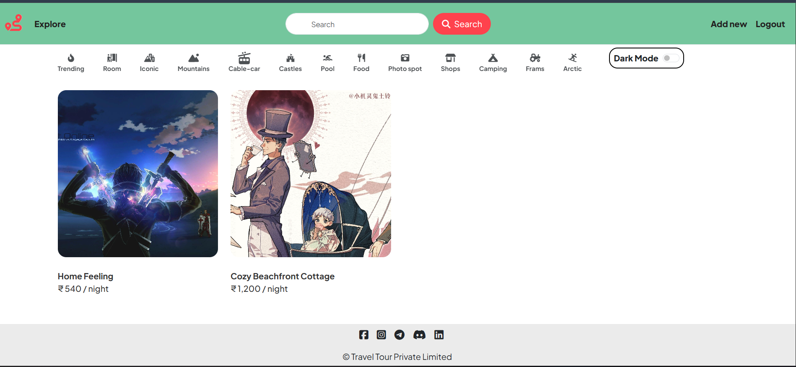

<div align="center">

  <a href="https://github.com/akshatharshit/Hotel-booking-MEHN-">
    
  </a>

[](https://github.com/akshatharshit/Hotel-booking-MEHN-/stargazers)
[](https://github.com/akshatharshit/Hotel-booking-MEHN-/network/members)
[](https://github.com/akshatharshit/Hotel-booking-MEHN-/issues)
[](https://github.com/akshatharshit/Hotel-booking-MEHN-/blob/main/LICENSE)
[](https://github.com/akshatharshit/Hotel-booking-MEHN-/commits)

  

</div>

<br>
<p align="center"></p>
<br>

## 📊 GitHub Stats

<div align="center">
  
  
</div>

## 📋 Table of Contents

- [GitHub Stats](#github-stats)
- [Overview](#overview)
- [Screenshots](#screenshots)
- [Features](#features)
- [Tech Stack](#tech-stack)
- [Project Structure](#project-structure)
- [Getting Started](#getting-started)
- [Usage](#usage)
- [Key Dependencies](#key-dependencies)
- [API Reference](#api-reference)
- [Roadmap](#roadmap)
- [Contributing](#contributing)
- [Feedback & Issues](#feedback-issues)
- [FAQ](#faq)
- [License](#license)
- [Acknowledgments](#acknowledgments)
- [Support](#support)

## 📖 Overview

**Hotel-booking-MEHN-** is a ⚙️ backend api.

A project using mern without react , mainly use for listing and others

## 📸 Screenshots

> Add your screenshots here. The image below is a placeholder!


<div align="center">
  
</div>

## ✨ Features

| Feature | Description |
| :--- | :--- |
| ⚡ **Modern Tech Stack** | Built with **Express** |
| ⚡ **Robust Database** | MongoDB database integration |
| ⚡ **Secure Authentication** | Authentication via Express Session, Passport.js |

## 🛠️ Tech Stack

**Languages:**
- JavaScript — 43.9%
- EJS — 31.7%
- CSS — 24.4%

**Framework:**


**Database:**


**Auth:**

 

## 📁 Project Structure

<details open>
<summary><b>Toggle Directory Tree</b></summary>
<br>

```
.
├── .vscode/
│   └── settings.json
├── images/
│   ├── background1.jpg
│   ├── background2.jpg
│   └── background3.jpg
├── init/
│   ├── data.js
│   ├── index.js
│   └── tempCodeRunnerFile.js
├── models/
│   ├── listing.js
│   ├── review.js
│   └── user.js
├── public/
│   ├── css/
│   │   ├── rating.css
│   │   └── style.css
│   └── js/
│       ├── map.js
│       └── script.js
├── routes/
│   ├── listing.js
│   ├── review.js
│   └── user.js
├── UtilsError/
│   ├── ExpressError.js
│   └── warpAsync.js
├── views/
│   ├── includes/
│   │   ├── flash.ejs
│   │   ├── footer.ejs
│   │   └── navbar.ejs
│   ├── layouts/
│   │   └── boilerplate.ejs
│   ├── listings/
│   │   ├── edit.ejs
│   │   ├── error.ejs
│   │   ├── index.ejs
│   │   ├── new.ejs
│   │   └── show.ejs
│   └── users/
│       ├── login.ejs
│       └── signup.ejs
├── .gitignore
├── app.js
├── cloudConfig.js
├── hotel_booking.png.png
├── middleware.js
├── package-lock.json
├── package.json
├── README.md
├── schema.js
└── tempCodeRunnerFile.js
```

</details>

## 🚀 Getting Started

### Prerequisites

- [Node.js](https://nodejs.org/) (v18 or higher recommended)
- npm or yarn

### Installation

```bash
# Clone the repository
git clone https://github.com/akshatharshit/Hotel-booking-MEHN-.git

# Navigate to project directory
cd Hotel-booking-MEHN-

# Install dependencies
npm install
```

## 💻 Usage

**🧪 Run tests**
```bash
npm run test
```
> `echo "Error: no test specified" && exit 1`

## 📦 Key Dependencies

| Package | Purpose |
| ------- | ------- |
| `dotenv` | Environment variables |
| `express` | Web framework |
| `joi` | Schema validation |
| `mongoose` | MongoDB ODM |
| `multer` | File upload middleware |
| `passport` | Authentication middleware |

## 🔌 API Reference

<details>
<summary><b>🔗 View API Details</b></summary>
<br>
> API endpoints are mapped and available in the `/routes` or `/controllers` directory.
> Please refer to the source code for highly detailed endpoint documentation and request/response schemas.
</details>

## 🛣️ Roadmap

- [x] **Phase 1**: Initial Release & Core Features
- [ ] **Phase 2**: Extended Functionality
- [ ] **Phase 3**: Community Integrations & Ecosystem

## 🤝 Contributing

Contributions are welcome! Here's how you can help:

1. **Fork** the repository
2. **Create** a feature branch (`git checkout -b feature/amazing-feature`)
3. **Commit** your changes (`git commit -m 'Add amazing feature'`)
4. **Push** to the branch (`git push origin feature/amazing-feature`)
5. **Open** a Pull Request

### Contributors

<a href="https://github.com/akshatharshit/Hotel-booking-MEHN-/graphs/contributors">
  
</a>

## 🐛 Feedback & Issues

Have feedback or found a bug? We'd love to hear from you!

- [Report a Bug](https://github.com/akshatharshit/Hotel-booking-MEHN-/issues/new?assignees=&labels=bug&template=bug_report.md&title=)
- [Request a Feature](https://github.com/akshatharshit/Hotel-booking-MEHN-/issues/new?assignees=&labels=enhancement&template=feature_request.md&title=)

## ❓ FAQ

<details>
  <summary><b>Why should I use this project?</b></summary>
  <br/>
  Because it's awesome and will save you tons of time!
</details>

<details>
  <summary><b>How do I contribute?</b></summary>
  <br/>
  Check out the <a href="#contributing">Contributing</a> section for details.
</details>

## 📄 License

This project does not currently specify a license.

## 🎉 Acknowledgments

- [Awesome Project](https://github.com/awesome/project)
- [Cool Resource](https://example.com)

## 💬 Support & Contact

If you found this project helpful, please consider giving it a ⭐ on [GitHub](https://github.com/akshatharshit/Hotel-booking-MEHN-)!

For support, business inquiries, or to report an issue, please open an issue in the repository or contact the maintainer.

<br>
<p align="center"></p>
<br>

<p align="center">Made with ❤️ by <a href="https://github.com/akshatharshit"><b>@akshatharshit</b></a></p>
